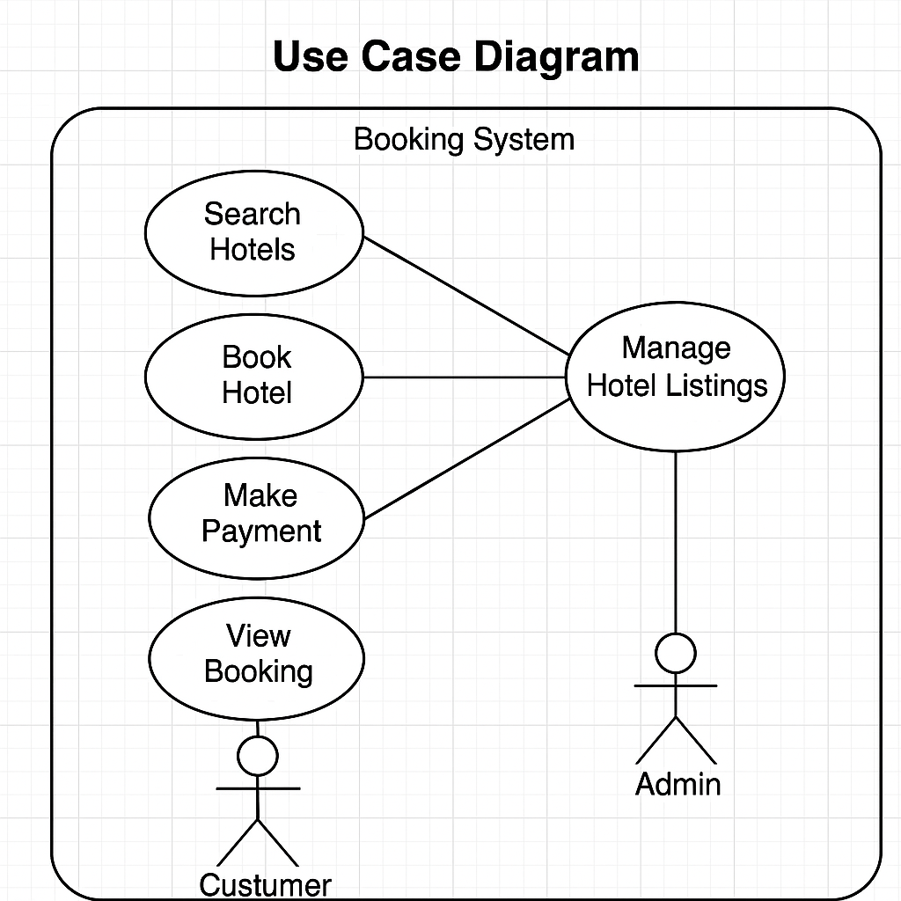

# Requirement Analysis in Software Development

## Introduction

This repository, `requirement-analysis`, is created to document and demonstrate the process and importance of requirement analysis in the software development lifecycle (SDLC). It provides a structured approach to understanding user needs, defining system behavior, and ensuring successful project delivery through accurate and thorough requirement documentation.

---

## What is Requirement Analysis?

Requirement Analysis is the process of identifying, documenting, and managing the needs and expectations of stakeholders for a new or altered product. It involves understanding what users require from a system and determining the technical feasibility and constraints.

### Importance in SDLC

- Serves as a foundation for all subsequent stages of the software development lifecycle.
- Helps ensure that the final system meets user expectations and business needs.
- Reduces risk of scope creep and costly rework.

---

## Why is Requirement Analysis Important?

- **Defines Scope Clearly:** Ensures all stakeholders have a mutual understanding of the deliverables.
- **Prevents Scope Creep:** Clearly documented requirements help control and manage changes.
- **Improves Quality:** Identifying requirements early leads to a more accurate and robust system design.

---

## Key Activities in Requirement Analysis

- **Requirement Gathering:** Collecting raw requirements from stakeholders via interviews, questionnaires, etc.
- **Requirement Elicitation:** Refining and clarifying requirements through interactive sessions with stakeholders.
- **Requirement Documentation:** Structuring the requirements into clear, accessible documentation.
- **Requirement Analysis and Modeling:** Analyzing the requirements for conflicts, ambiguities, and modeling with diagrams or structured formats.
- **Requirement Validation:** Ensuring the documented requirements meet stakeholder needs and are feasible.

---

## Types of Requirements

### Functional Requirements

Define what the system should do.

**Examples for Booking Management System:**

- Users can register, log in, and manage their profiles.
- Customers can search, filter, and book hotels.
- Managers can add or update hotel listings.
- Integration with payment gateways for secure checkout.

### Non-functional Requirements

Define how the system should behave.

**Examples:**

- **Performance:** The system must handle 1,000 concurrent users.
- **Scalability:** Must scale horizontally to support traffic during peak seasons.
- **Availability:** 99.9% uptime required.
- **Security:** All customer data must be encrypted in transit and at rest.
- **Usability:** UI should be mobile responsive and load within 2 seconds.

---

## Use Case Diagrams

Use Case Diagrams provide a visual representation of how users interact with a system.

### Benefits:

- Clarify user roles and interactions
- Identify system boundaries
- Serve as a communication tool between stakeholders

### Example: Booking Management System

Actors:  
- **Customer**  
- **Hotel Manager**  
- **Admin**  

Use Cases:  
- Search Hotels  
- Book Hotel  
- Make Payment  
- View Booking  
- Manage Hotel Listings  
- Manage Users  

---

## Acceptance Criteria

Acceptance Criteria are a set of predefined conditions that a feature must satisfy to be accepted by a user or system.

### Importance:

- Acts as a benchmark for validating requirements
- Reduces ambiguity in development and testing
- Helps QA teams understand the expected functionality

### Example: Checkout Feature

**Feature:** Hotel Booking Checkout  
**Acceptance Criteria:**

- Given a logged-in user, when they select a room and click "Checkout", they should be taken to a payment screen.
- The system should calculate and display total cost including taxes and discounts.
- User must be able to select a payment method and confirm the booking.
- Confirmation email should be sent after successful payment.

---

## License

This project is licensed under the MIT License.

---

## Author

Kevin Odhiambo  
Software Developer | Requirement Engineering Advocate

